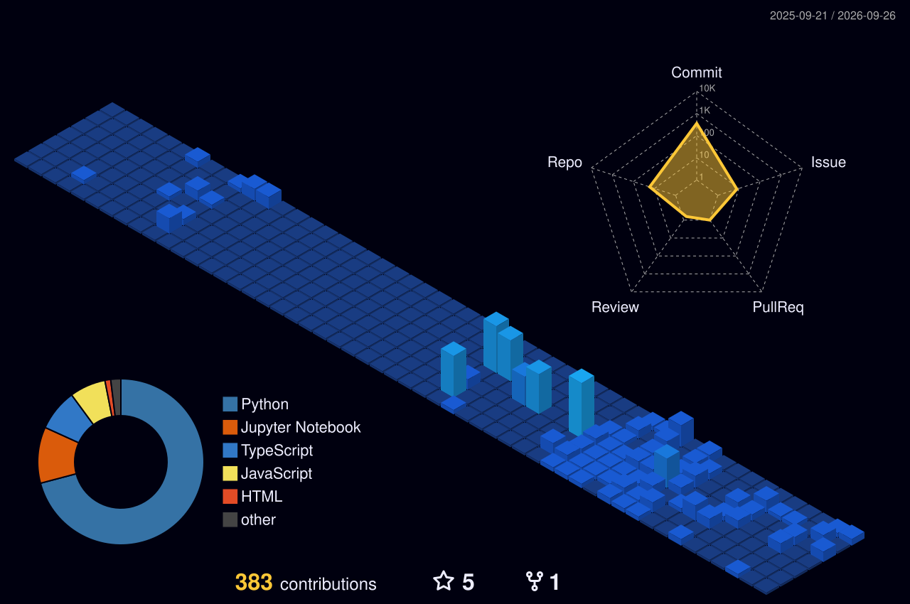

<div align="center">



<a href="https://github.com/mayur212626">
  
</a>

<br/>


<br/><br/>

<a href="https://mjpatil.com/">
  
</a>
<a href="https://linkedin.com/in/mayurpatil26">
  
</a>
<a href="mailto:mayur.patil@gwmail.gwu.edu">
  
</a>
<a href="https://github.com/mayur212626">
  
</a>

<br/><br/>


<a href="https://github.com/mayur212626?tab=followers">
  
</a>
<a href="https://github.com/mayur212626?tab=repositories">
  
</a>

</div>

<div align="center"></div>

## 🧠 About

```text
Models that hold up in the real world — not just on paper.
```

I'm a **Data Science & ML Engineer** and M.S. Data Science candidate at **George Washington University**, originally from Pune, India, now based in Falls Church, VA. I got into this field for the moment when a messy dataset starts to make sense — and I stayed for the harder problem: making models survive contact with production.

- 🔬 I build **end-to-end ML systems** — deployed APIs, live dashboards, CI/CD, bias audits, drift detection, and SHAP explainability ship with the model, not after it
- 📊 Statistical depth: **Bayesian hierarchical modeling (PyMC), Monte Carlo simulation, Dixon-Coles**, and rigorous out-of-sample backtesting with pre-registered forecasts
- 🤖 **Trustworthy AI**: pre-registered LLM evaluation experiments, RAG citation faithfulness, LLM-as-judge pipelines
- 🎨 Full stack range: **Next.js + React Three Fiber + custom GLSL shaders** — I ship interactive 3D web products, not just models
- ⚙️ Production tooling: **FastAPI, Docker, MLflow, PySpark, AWS SageMaker**, Streamlit
- 📄 Published researcher — 2 papers in international journals on data security and gesture recognition

> **Open To:** Summer 2026 Data Science internships (open to relocation) • ML research collaboration • Full stack product work • Open source

<div align="center"></div>

## 🛠️ Tech Stack

<div align="center">

### Languages


### Machine Learning & Statistics


### Frontend & 3D


### Backend, Data & Databases


### Cloud, DevOps & Tooling


</div>

<div align="center"></div>

## 🤖 AI / ML Expertise

<div align="center">

| Domain | Proficiency | Details |
|:-------|:-----------:|:--------|
| **Statistical Modeling & Simulation** | ▰▰▰▰▰▱ | Dixon-Coles bivariate Poisson, hierarchical Bayesian models (PyMC), Elo, Monte Carlo tournament simulation, calibration analysis (Brier, log-loss) |
| **Machine Learning** | ▰▰▰▰▰▱ | Classification, regression, ensembles (Isolation Forest, LOF), fairness audits, out-of-sample backtesting with Scikit-learn |
| **Deep Learning** | ▰▰▰▰▰▱ | LSTMs, CNNs, PyTorch & TensorFlow — time-series forecasting and classification at 90%+ accuracy |
| **NLP & LLM Evaluation** | ▰▰▰▰▱▱ | RAG pipelines, citation-faithfulness verification, LLM-as-judge scoring, financial news sentiment (6,700+ articles) |
| **Big Data Engineering** | ▰▰▰▰▰▱ | PySpark pipelines over 500K+ record datasets, ETL, feature engineering at scale |
| **MLOps & Deployment** | ▰▰▰▰▰▱ | FastAPI serving, Docker, MLflow, AWS SageMaker/S3, live-updating forecast loops, drift detection, CI/CD |

</div>

<div align="center"></div>

## 📡 Live Forecast — World Cup 2026

<div align="center">

*My deployed Dixon-Coles + Monte Carlo model, streaming its latest title odds directly into this README via GitHub Actions.*

</div>

<!--FORECAST:START-->
<div align="center">

| # | Team | Semis | Final | 🏆 Title odds |
|:-:|:-----|:-----:|:-----:|:--------------|
| 🥇 | **Argentina** | 37.9% | 26.2% | `██████████` **17.3%** |
| 🥈 | **Spain** | 31.0% | 19.9% | `███████░░░` **11.9%** |
| 🥉 | **England** | 22.2% | 12.2% | `████░░░░░░` **6.8%** |
| 4 | **Brazil** | 22.0% | 11.4% | `███░░░░░░░` **5.9%** |
| 5 | **Portugal** | 20.6% | 11.6% | `███░░░░░░░` **5.6%** |
| 6 | **Morocco** | 19.4% | 10.2% | `███░░░░░░░` **5.3%** |
| 7 | **France** | 20.4% | 10.2% | `███░░░░░░░` **5.2%** |
| 8 | **Germany** | 20.0% | 9.5% | `███░░░░░░░` **4.6%** |

*Last synced: **Aug 27, 2026 · 06:31 UTC** · refreshed automatically by GitHub Actions · 5,000 Monte Carlo simulations per run*

[**Model & code**](https://github.com/mayur212626/fifa-wc2026-predictor) · [**Live dashboard**](https://wc2026-title-race.onrender.com)

</div>
<!--FORECAST:END-->

<div align="center"></div>

## 🚀 Featured Projects

<details>
<summary><b>🔎 DocMind — RAG Document Q&A with Cited Sources</b></summary>
<br/>

Chat with your PDFs and get answers backed by the exact source passage — with a guardrail that refuses to answer when the documents don't cover the question, instead of hallucinating a confident wrong answer.

| Attribute | Details |
|:----------|:--------|
| **Stack** | Python, LlamaIndex, ChromaDB, OpenAI, pypdf, Streamlit |
| **Scale** | Multi-PDF ingestion → page-level chunking → embeddings → persisted vector store that survives restarts |
| **Performance** | Retrieval-scored guardrail declines out-of-scope questions; every answer cites its source file and page |
| **Security** | Runs locally, API key kept in a gitignored env, page-level provenance for auditability |
| **Impact** | Turns a pile of policy docs, manuals, and handbooks into a searchable, trustworthy knowledge base |
| **Repository** | [github.com/mayur212626/docmind](https://github.com/mayur212626/docmind) |

Built so the honesty matters more than the demo: retrieval strength is checked before generation, so a weak match returns "I couldn't find that" rather than a fabricated policy. End-to-end tested against a sample handbook.

</details>

<details>
<summary><b>📊 DataPilot — AI Data Analyst Agent</b></summary>
<br/>

An agent that *works* your data instead of talking about it: upload a CSV, ask a question in plain English, and it writes and runs real pandas in a sandbox, then answers with a chart and a recommendation. Every number comes from code that actually ran.

| Attribute | Details |
|:----------|:--------|
| **Stack** | Python, OpenAI tool-calling, pandas, NumPy, matplotlib, Streamlit |
| **Scale** | Agentic loop: auto-profile → generate pandas → execute → interpret → chart, over an arbitrary uploaded CSV |
| **Performance** | Answers are grounded in executed output, never guessed; a notebook-style echo lets the agent see results and converge |
| **Security** | Model-generated code runs in a restricted sandbox — whitelisted builtins and imports, no file or network access |
| **Impact** | Replaces the hour a junior analyst spends poking at a file to answer a single question |
| **Repository** | [github.com/mayur212626/datapilot](https://github.com/mayur212626/datapilot) |

A real tool-use agent, not a chatbot: it profiles the data, reasons over real output, and ends with a concrete recommendation. Ships with offline sandbox-safety tests and an end-to-end live agent test.

</details>

<details>
<summary><b>⚽ World Cup 2026 Forecasting Engine — Bayesian Modeling + Monte Carlo Simulation</b></summary>
<br/>

Goal-based statistical model trained on ~16,000 international matches, simulating the full 48-team 2026 bracket 5,000 times — with the forecast **frozen before kickoff** (June 8, 2026) so predictions are genuine, not hindsight. Served through a live dashboard and REST API.

| Attribute | Details |
|:----------|:--------|
| **Stack** | Python, PyMC, SciPy, statsmodels, Scikit-learn, Streamlit, FastAPI, Altair, Docker, pytest |
| **Scale** | ~16,000 matches • 5,000 full-tournament Monte Carlo simulations • 48-team bracket with real tiebreakers |
| **Performance** | Beats climatology & uniform baselines on 2018 and 2022 backtests (Brier 0.566 / 0.614) with honest mid-range calibration |
| **Security** | Reproducible pipeline, versioned forecast snapshots, pre-tournament data cutoff for audit integrity |
| **Impact** | Live title-race dashboard + `/predict` API; hierarchical Bayesian version quantifies rating uncertainty (r-hat ≈ 1.0) |
| **Repository** | [github.com/mayur212626/fifa-wc2026-predictor](https://github.com/mayur212626/fifa-wc2026-predictor) • [Live Dashboard](https://wc2026-title-race.onrender.com) |

Four modeling layers — Elo baseline, Dixon-Coles bivariate Poisson, hierarchical Bayesian (PyMC) with partial pooling, and Monte Carlo simulation — plus a live update loop that refits on real results and re-simulates only the remaining bracket. Tested with a pytest suite covering probability axioms and simulation coherence.

</details>

<details>
<summary><b>🌋 Las Placitas — Immersive 3D Restaurant Web Experience</b></summary>
<br/>

Concept redesign for a DC restaurant built around a real-time 3D volcano with a hand-written GLSL lava shader — full ordering flow, bilingual UI, and PWA support. Live on Vercel and actively evolving.

| Attribute | Details |
|:----------|:--------|
| **Stack** | Next.js (App Router), TypeScript, React Three Fiber + drei, custom GLSL, Framer Motion, Lenis, Tailwind CSS, Leaflet |
| **Scale** | Full product surface: menu with live search/filtering, cart + checkout flow, reservations, dual-location map, EN/ES i18n |
| **Performance** | 3D loop pauses off-screen, bloom/post-processing tuned for 60fps, reduced-motion accessibility respected |
| **Security** | PWA with offline service worker, schema.org structured data, semantic metadata, custom 404/loading states |
| **Impact** | Demonstrates end-to-end product engineering: 3D graphics, motion design, state management, i18n, and SEO in one shipped app |
| **Repository** | [github.com/mayur212626/las-placitas-web](https://github.com/mayur212626/las-placitas-web) • [Live Site](https://las-placitas-web.vercel.app) |

Persistent cart with slide-in drawer and full checkout (pickup, tip, tax), word-by-word headline reveals, magnetic buttons, custom cursor with ember trail, heat-haze hover distortion, and a synthesized fire-crackle audio toggle — no audio files.

</details>

<details>
<summary><b>🏥 Clinical Lab Abnormality Predictor — Deployed Diabetes Risk ML System</b></summary>
<br/>

Full end-to-end ML system that predicts diabetes risk from clinical lab values — not just a notebook, but a real deployed pipeline with a live API, bias audits, SHAP explanations, and CI/CD.

| Attribute | Details |
|:----------|:--------|
| **Stack** | PyTorch, Scikit-learn, FastAPI, AWS SageMaker, Docker, MLflow, SHAP |
| **Scale** | End-to-end pipeline: ingestion → training → registry → live inference API |
| **Performance** | AUC-ROC **0.9618** • 89% accuracy • 92% sensitivity |
| **Security** | Bias-audited with **zero fairness disparity** across demographic groups |
| **Impact** | Production-grade clinical decision support with per-prediction SHAP explanations |
| **Repository** | [github.com/mayur212626/clinical-lab-predictor](https://github.com/mayur212626/clinical-lab-predictor) • [Live API](https://clinical-lab-predictor.onrender.com) |

Designed as a real ML product: experiment tracking in MLflow, containerized FastAPI serving, automated CI/CD, and fairness validation baked into the release gate rather than bolted on afterward.

</details>

<details>
<summary><b>🔬 RAG Citation Faithfulness — Pre-Registered Trustworthy AI Experiment</b></summary>
<br/>

Controlled experiment testing whether post-hoc verifiers (Chain-of-Verification and quote-then-cite) improve citation faithfulness in RAG systems — with hypotheses, metrics, and hard cases **pre-registered in git before any API call was made**.

| Attribute | Details |
|:----------|:--------|
| **Stack** | Python, Anthropic API, HotpotQA (HuggingFace), BM25, LLM-as-judge, bootstrap statistics, matplotlib |
| **Scale** | Full eval pipeline over HotpotQA corpus with held-out qualitative set and incremental crash-safe runs |
| **Performance** | Claim-level judging (SUPPORTED/PARTIAL/UNSUPPORTED/CONTRADICTED) with bootstrap CIs and paired significance tests |
| **Security** | Pre-registration committed at a fixed hash — metric definitions locked before results existed |
| **Impact** | Honest findings: one intervention worked, one mostly didn't — failure modes documented, not hidden |
| **Repository** | [github.com/mayur212626/rag-trust](https://github.com/mayur212626/rag-trust) |

Research-grade rigor applied to LLM evaluation: locked hypotheses, Pareto analysis of faithfulness vs. cost, and a transparent postmortem of what broke (CoVe JSON fragility, single-chunk judge strictness).

</details>

<details>
<summary><b>🔍 Large-Scale Log Anomaly Detection — 500K+ Record Ensemble Pipeline</b></summary>
<br/>

Unsupervised anomaly detection over 500,000+ HTTP server log records using an ensemble of Isolation Forest, Local Outlier Factor, and a domain rule engine — with drift detection and SHAP explainability built in.

| Attribute | Details |
|:----------|:--------|
| **Stack** | PySpark, Scikit-learn (Isolation Forest, LOF), MLflow, FastAPI, AWS S3 |
| **Scale** | 500,000+ log records processed through distributed PySpark preprocessing |
| **Performance** | **540× critical-error lift** • Precision@100 of **0.78** |
| **Security** | Anomaly surfacing for security-relevant error patterns; auditable rule engine |
| **Impact** | Turns raw server logs into ranked, explainable incident candidates for ops teams |
| **Repository** | [github.com/mayur212626/anomaly-detection](https://github.com/mayur212626/anomaly-detection) |

Ensemble scores are fused with a rule engine for interpretability, monitored for distribution drift, and served through a FastAPI scoring endpoint with artifacts stored on S3.

</details>

<details>
<summary><b>🚢 Ship Type & COG Prediction — 358K-Record AIS Maritime Dataset</b></summary>
<br/>

Machine learning on 358,000+ real AIS vessel records: course-over-ground regression and deep learning vessel-type classification with a full PySpark preprocessing and model governance pipeline.

| Attribute | Details |
|:----------|:--------|
| **Stack** | Scikit-learn, PySpark, SQL, Deep Learning (TensorFlow/Keras) |
| **Scale** | 358,000+ real-world AIS vessel records |
| **Performance** | COG regression **R² 0.94** • Vessel classifier **92% accuracy, AUC 0.98** |
| **Security** | Governed pipeline with validated preprocessing and documented model lineage |
| **Impact** | Reliable vessel behavior prediction from noisy real-world maritime telemetry |
| **Repository** | [github.com/mayur212626/PREDICTION-OF-SHIP-TYPE-AND-COG-FROM-AIS-DATA-SET](https://github.com/mayur212626/PREDICTION-OF-SHIP-TYPE-AND-COG-FROM-AIS-DATA-SET) |

Heavy-lift data engineering project: distributed cleaning of raw AIS transponder data, class-imbalance handling, and dual-task modeling (regression + classification) under one governance framework.

</details>

<details>
<summary><b>📈 Stock Price Prediction — LSTM + Financial News Sentiment</b></summary>
<br/>

Deep learning forecasting pipeline on AWS SageMaker fusing 39 technical indicators with NLP sentiment extracted from 6,700+ financial news articles.

| Attribute | Details |
|:----------|:--------|
| **Stack** | PyTorch (LSTM), AWS SageMaker, NLP sentiment pipeline, PySpark |
| **Scale** | 6,700+ news articles processed • 39 engineered technical indicators |
| **Performance** | MAPE **7.19%** — **7.1% improvement** over baseline models |
| **Security** | Reproducible SageMaker training jobs with versioned data and model artifacts |
| **Impact** | Demonstrates measurable gains from multimodal (price + text) feature fusion |
| **Repository** | [github.com/mayur212626](https://github.com/mayur212626?tab=repositories) |

Built the full loop: PySpark feature engineering, sentiment scoring of news text, sequence modeling with LSTM, and rigorous baseline comparison to validate the sentiment signal's contribution.

</details>

<div align="center"></div>

## 💼 Experience

### Graduate Student — M.S. Data Science
**George Washington University** &nbsp;•&nbsp; *2025 – Present*

Graduate coursework and applied research in machine learning, deep learning, NLP, and big data systems — with every major project built to production standards.

- Designed and deployed **7 end-to-end systems** spanning Bayesian forecasting, clinical ML, LLM evaluation, anomaly detection, and interactive 3D web
- Shipped **3 live products**: a World Cup forecasting dashboard, a clinical prediction API, and a 3D restaurant web experience
- Engineered **PySpark pipelines** over datasets of 350K–500K+ records with full preprocessing governance
- Pre-registered a Trustworthy AI experiment on RAG citation faithfulness with locked hypotheses and LLM-as-judge evaluation

`PyTorch` `PyMC` `PySpark` `FastAPI` `Streamlit` `Next.js` `React Three Fiber` `Docker` `MLflow` `AWS`

### Published Researcher
**International Journal of Innovative Research** &nbsp;•&nbsp; *2024*

Authored peer-reviewed publications during undergraduate studies in Pune, India.

- 📄 *Data Security Management* — September 2024
- 📄 *Gesture Recognition Using Virtual Mouse* — August 2024

`Research` `Data Security` `Computer Vision` `Technical Writing`

<div align="center"></div>

## 🏆 Achievements

<div align="center">

| Recognition | Details |
|:-----------:|:--------|
| ⚽ **Pre-Registered Forecaster** | World Cup 2026 forecast frozen before kickoff — beat climatology & uniform baselines on 2018/2022 backtests |
| 📄 **Published Author ×2** | Peer-reviewed papers on Data Security Management and Gesture Recognition (Int'l Journal of Innovative Research, 2024) |
| 🩺 **Production ML at 0.96 AUC** | Clinical diabetes-risk system deployed with live API, zero fairness disparity, and full CI/CD |
| 🔍 **540× Anomaly Lift** | Ensemble log-anomaly engine over 500K+ records with Precision@100 of 0.78 |
| 🌋 **Shipped 3D Web Product** | Live Next.js + React Three Fiber experience with custom GLSL shaders, PWA support, and bilingual UI |
| ⚡ **GitHub Quickdraw** | Recognized for rapid issue-to-resolution turnaround on GitHub |

</div>

<div align="center"></div>

## 📜 Certifications

<div align="center">

### AWS


### Oracle


### NPTEL


### Cisco


</div>

<div align="center"></div>

## ⚔️ Coding Profiles

<div align="center">

<a href="https://leetcode.com/u/mayur212626">
  
</a>
<a href="https://www.geeksforgeeks.org/user/mayur212626">
  
</a>
<a href="https://www.hackerrank.com/profile/mayur212626">
  
</a>
<a href="https://www.codechef.com/users/mayur212626">
  
</a>

</div>

<div align="center"></div>

## 📊 GitHub Analytics

<div align="center">


<br/><br/>


<br/><br/>


</div>

<div align="center"></div>

## 🏅 GitHub Trophies

<div align="center">


</div>

<div align="center"></div>

## 📈 Contribution Activity

<div align="center">



<br/><br/>


</div>

<div align="center"></div>

## 🐍 Contribution Snake

<div align="center">

<picture>
  <source media="(prefers-color-scheme: dark)" srcset="https://raw.githubusercontent.com/mayur212626/Mayur212626/output/github-contribution-grid-snake-dark.svg"/>
  <source media="(prefers-color-scheme: light)" srcset="https://raw.githubusercontent.com/mayur212626/Mayur212626/output/github-contribution-grid-snake.svg"/>
  
</picture>

</div>

<div align="center"></div>

## ⏱️ Weekly Coding Breakdown

<!--START_SECTION:waka-->

```txt
No activity tracked
```

<!--END_SECTION:waka-->

<div align="center"></div>

## 🎯 Current Focus

```yaml
learning:
  - Advanced Bayesian modeling & probabilistic programming (PyMC)
  - LLM evaluation, RAG faithfulness & trustworthy AI methods
  - GLSL shaders & real-time 3D graphics on the web

building:
  - Live World Cup 2026 forecast updates as the tournament unfolds
  - Las Placitas — immersive 3D restaurant web experience (active WIP)
  - Production ML systems with deployed APIs, not just notebooks

exploring:
  - Multimodal feature fusion (text + time-series + tabular)
  - Model calibration & uncertainty quantification
  - Creative frontend engineering meets data products

open_to:
  - Summer 2026 Data Science internships (open to relocation)
  - ML research collaboration
  - Full stack / creative web product work
```

<div align="center"></div>

## 🤝 Connect

<div align="center">

<a href="mailto:mayur.patil@gwmail.gwu.edu">
  
</a>
<a href="https://linkedin.com/in/mayurpatil26">
  
</a>
<br/>
<a href="https://github.com/mayur212626">
  
</a>
<a href="https://mjpatil.com/">
  
</a>

</div>

<div align="center"></div>

<div align="center">

*"A model is only as good as the day it meets real data — build for that day."*


</div>
